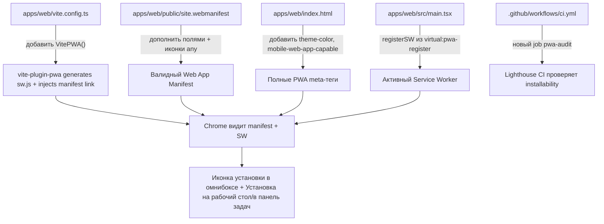

# План: превратить Kaneo Web в устанавливаемое PWA (Chrome install icon)

## Контекст (что уже есть)

- `apps/web/index.html` уже содержит `<link rel="manifest" href="/site.webmanifest" />`, `favicon.svg`, `apple-touch-icon.png`, но **нет** `<meta name="theme-color">` и `<meta name="mobile-web-app-capable">`.
- `apps/web/public/site.webmanifest` существует, но неполный: нет `start_url`, `scope`, `id`, `description`; иконки (`web-app-manifest-192x192.png`, `web-app-manifest-512x512.png`) объявлены только с `"purpose": "maskable"` — Chrome для показа иконки установки в омнибоксе надёжнее работает, когда есть иконка с `"purpose": "any"`.
- **Service worker отсутствует полностью** — это главная причина, почему Chrome не показывает иконку установки (для installability нужен manifest + зарегистрированный SW с fetch-хендлером, отданный по HTTPS/localhost).
- `apps/web/vite.config.ts` не использует `vite-plugin-pwa` — плагин не установлен.
- CI (`.github/workflows/ci.yml`) имеет джобы `lint`, `unit`, `build`, `integration`, `docker-build`, но нет проверки PWA/installability.
- Тесты в `apps/web` — Vitest + Testing Library, паттерн `src/**/*.test.{ts,tsx}`, setup в `apps/web/src/test/setup.ts`.

## Диаграмма изменений



## TODO 1 — Зависимости

- [ ] В `apps/web/package.json` добавить в `devDependencies`:
  - `vite-plugin-pwa` (последняя версия, совместимая с Vite 7)
  - `workbox-window` (используется плагином для `virtual:pwa-register`)
  - `sharp` (только для одноразового скрипта генерации иконок, см. TODO 3)
- [ ] Выполнить `pnpm install` в корне монорепо.

## TODO 2 — Конфигурация `vite-plugin-pwa` в `apps/web/vite.config.ts`

Файл сейчас:

```8:21:apps/web/vite.config.ts
export default defineConfig({
  define: {
    __APP_VERSION__: JSON.stringify(packageJson.version),
  },
  base: "/",
  plugins: [
    tanstackRouter({ autoCodeSplitting: true }),
    tailwindcss(),
    react({
      babel: {
        plugins: [["babel-plugin-react-compiler"]],
      },
    }),
  ],
```

- [ ] Импортировать `VitePWA` из `vite-plugin-pwa` и добавить в массив `plugins` **последним** (после react-плагина).
- [ ] Настройки плагина:
  - `registerType: "autoUpdate"` (SW обновляется в фоне без блокировки пользователя).
  - `manifest: false` — не дублировать конфигурацию, продолжаем использовать статический `public/site.webmanifest`, который плагин просто скопирует и провалидирует наличие ссылки. (Альтернатива — inline `manifest` в конфиге; выбираем `false`, чтобы не плодить два источника правды и не трогать существующий `<link rel="manifest">`.)
  - `injectRegister: false` — регистрацию SW делаем вручную из `main.tsx` (TODO 5), чтобы контролировать UX уведомления об обновлении через уже используемый `sonner`.
  - `includeAssets`: `["favicon.svg", "favicon.ico", "favicon-96x96.png", "apple-touch-icon.png"]`.
  - `workbox`:
    - `navigateFallback: "/index.html"` — для корректной работы SPA-роутинга офлайн/при кэше.
    - `navigateFallbackDenylist: [/^\/api/]` — не подменять запросы к API.
    - `runtimeCaching`:
      - `urlPattern: /^https?:\/\/.*\/api\//`, `handler: "NetworkOnly"` — данные всегда свежие, приложение не рассчитано на офлайн-работу с бизнес-данными (self-hosted task manager, устаревшие задачи опасны).
      - `urlPattern` для статичных ассетов (`.js`, `.css`, шрифты) → `handler: "StaleWhileRevalidate"`.
      - `urlPattern` для изображений (`.png`, `.jpg`, `.svg`) → `handler: "CacheFirst"`, `expiration: { maxEntries: 60, maxAgeSeconds: 30 * 24 * 60 * 60 }`.
  - `devOptions: { enabled: true, type: "module" }` — чтобы SW работал и в `pnpm dev` для локального тестирования установки.
- [ ] Добавить `dev-dist` (директория, которую `vite-plugin-pwa` создаёт в dev-режиме) в корневой `.gitignore`.

## TODO 3 — Иконки

- [ ] Создать одноразовый скрипт `apps/web/scripts/generate-pwa-icons.mjs`, использующий `sharp`, чтобы перегенерировать все PNG-иконки из векторного `apps/web/public/favicon.svg` (136×136, квадратный, уже содержит цветной фон `#141414` — идеальный источник):
  - `web-app-manifest-192x192.png` (192×192, `purpose: any`)
  - `web-app-manifest-512x512.png` (512×512, `purpose: any`)
  - `web-app-manifest-192x192-maskable.png` / `web-app-manifest-512x512-maskable.png` — с padding ~10% (safe zone для maskable, т.к. текущие иконки просто растянуты и промаркированы `maskable`, что при обрезке ОС в круг может обрезать логотип).
  - `apple-touch-icon.png` (180×180, без прозрачности, с небольшим паддингом — Apple не поддерживает alpha-каналы красиво).
  - `favicon-96x96.png` (96×96).
  - `favicon.ico` (multi-size 16/32/48).
- [ ] Запустить скрипт один раз локально (`node apps/web/scripts/generate-pwa-icons.mjs`) и закоммитить результат в `apps/web/public/`. Скрипт **не** встраивается в build pipeline (простой одноразовый инструмент для будущих обновлений логотипа, не добавляет `sharp` в рантайм-зависимости прод-сборки).

## TODO 4 — Манифест `apps/web/public/site.webmanifest`

Текущее содержимое:

```1:21:apps/web/public/site.webmanifest
{
	"name": "Kaneo",
	"short_name": "Kaneo",
	"icons": [
		{ "src": "/web-app-manifest-192x192.png", "sizes": "192x192", "type": "image/png", "purpose": "maskable" },
		{ "src": "/web-app-manifest-512x512.png", "sizes": "512x512", "type": "image/png", "purpose": "maskable" }
	],
	"theme_color": "#141414",
	"background_color": "#141414",
	"display": "standalone"
}
```

- [ ] Дополнить полями:
  - `"id": "/"`
  - `"start_url": "/"`
  - `"scope": "/"`
  - `"description": "All you need. Nothing you don't. Open source project management that works for you, not against you."`
  - `"display": "standalone"` (оставить)
  - `"orientation": "any"`
  - `"categories": ["productivity", "business"]`
- [ ] Заменить блок `icons`, добавив по одной записи `purpose: "any"` и `purpose: "maskable"` на каждый размер (4 записи всего) — используя новые файлы из TODO 3.

## TODO 5 — `apps/web/index.html`: мета-теги

Текущий `<head>`:

```26:33:apps/web/index.html
  <link rel="icon" type="image/svg+xml" href="/favicon.svg" />
  <link rel="shortcut icon" href="/favicon.svg" />
  <link rel="apple-touch-icon" href="/apple-touch-icon.png" />
  <meta name="apple-mobile-web-app-title" content="Kaneo" />
  <link rel="manifest" href="/site.webmanifest" />

  <meta name="viewport" content="width=device-width, initial-scale=1.0" />
  <meta name="application-name" content="Kaneo">
```

- [ ] Добавить сразу после `<link rel="manifest">`:
  - `<meta name="theme-color" content="#141414" />`
  - `<meta name="mobile-web-app-capable" content="yes" />`
  - `<meta name="apple-mobile-web-app-capable" content="yes" />`
  - `<meta name="apple-mobile-web-app-status-bar-style" content="black-translucent" />`
- [ ] `vite-plugin-pwa` с `injectRegister: false` не добавляет теги автоматически — регистрацию SW делаем сами (TODO 6), поэтому HTML менять для регистрации не нужно.

## TODO 6 — Регистрация Service Worker в приложении

- [ ] Создать `apps/web/src/lib/pwa/register-sw.ts`:
  - Импортировать `registerSW` из `virtual:pwa-register`.
  - Экспортировать функцию `initServiceWorker()`, вызывающую `registerSW({ immediate: true, onNeedRefresh, onOfflineReady })`.
  - `onNeedRefresh` — показывает `toast` (через уже используемый `sonner`, см. `apps/web/src/components/...` паттерны) с кнопкой "Обновить" (или "Update"), которая при клике вызывает `updateSW(true)`.
  - `onOfflineReady` — тихий `toast.success("Приложение готово к работе офлайн")` (или локализованная строка через `i18next`, см. `apps/web/src/lib/i18n`).
- [ ] Вызвать `initServiceWorker()` в `apps/web/src/main.tsx` внутри блока `if (!rootElement.innerHTML)`, после `root.render(...)`.
- [ ] Добавить в `apps/web/src/vite-env.d.ts` (сейчас содержит только `/// <reference types="vite/client" />`) референс `/// <reference types="vite-plugin-pwa/client" />` для типизации `virtual:pwa-register`.

## TODO 7 — Тесты

- [ ] `apps/web/src/lib/pwa/register-sw.test.ts`: мокировать `virtual:pwa-register` через `vi.mock`, проверить что:
  - `initServiceWorker()` вызывает `registerSW` с `immediate: true`.
  - при вызове `onNeedRefresh` показывается toast (мок `sonner`, аналогично существующим тестам, например `apps/web/src/components/ui/toggle.test.tsx`).
  - при вызове `onOfflineReady` показывается toast успеха.
- [ ] `apps/web/src/manifest.test.ts` (новый, простой sanity-тест конфигурации, не требующий браузера):
  - Прочитать `apps/web/public/site.webmanifest` через `node:fs`, распарсить JSON.
  - Assert: присутствуют обязательные для installability поля — `name`, `short_name`, `start_url`, `display` ∈ `["standalone","fullscreen","minimal-ui"]`, `icons.length >= 2`.
  - Assert: среди `icons` есть минимум одна запись с `sizes: "192x192"` и одна с `sizes: "512x512"`, и хотя бы по одной из них имеет `purpose` включающий `"any"`.
- [ ] Обновить/добавить существующий тест для `apps/web/index.html`, если в проекте уже тестируется HTML (не найдено — пропустить, не создавать новую инфраструктуру ради этого).
- [ ] Прогнать `pnpm --filter @kaneo/web test` — все тесты зелёные.

## TODO 8 — CI/CD: проверка installability

Текущий `.github/workflows/ci.yml` содержит джобы `lint`, `unit`, `build`, `integration`, `docker-build`.

- [ ] Добавить новый job `pwa-audit`, зависящий от `build` (`needs: build`):

```yaml
  pwa-audit:
    runs-on: ubuntu-24.04
    needs: build
    steps:
      - name: Checkout repository
        uses: actions/checkout@v6

      - name: Setup pnpm
        uses: pnpm/action-setup@v6
        with:
          version: 10.32.1

      - name: Setup Node.js
        uses: actions/setup-node@v6
        with:
          node-version: 20.20.2
          cache: pnpm

      - name: Install dependencies
        run: pnpm install --frozen-lockfile

      - name: Build web app
        run: pnpm --filter @kaneo/web build

      - name: Run Lighthouse CI (PWA category)
        uses: treosh/lighthouse-ci-action@v12
        with:
          urls: |
            http://localhost:4173/
          configPath: ./apps/web/lighthouserc.json
          startServerCommand: pnpm --filter @kaneo/web preview -- --port 4173
          startServerReadyPattern: "Local:"
          uploadArtifacts: true
          temporaryPublicStorage: true
```

- [ ] Создать `apps/web/lighthouserc.json` с порогом для категории PWA:

```json
{
  "ci": {
    "assert": {
      "assertions": {
        "categories:pwa": ["error", { "minScore": 0.9 }]
      }
    }
  }
}
```

- [ ] Убедиться, что job не блокирует остальные (не required check на первое время можно оставить обычным, т.к. Lighthouse иногда флэки — но по умолчанию делаем обязательным, при нестабильности вынести в отдельный `nightly.yml`, если возникнут ложные срабатывания).

## TODO 9 — Ручная проверка (после реализации)

- [ ] Собрать и поднять прод-сборку: `pnpm --filter @kaneo/web build && pnpm --filter @kaneo/web preview`.
- [ ] Открыть в Chrome, проверить DevTools → Application → Manifest (нет ошибок, иконки подгружены) и Application → Service Workers (зарегистрирован, статус activated).
- [ ] Проверить, что в адресной строке Chrome появляется иконка установки (⊕ / компьютер с стрелкой) и через неё приложение устанавливается на рабочий стол/в панель задач/меню приложений.
- [ ] Прогнать Lighthouse (вкладка Lighthouse в DevTools) с категорией PWA — все installability-чекбоксы зелёные.
- [ ] Использовать skill `verify` (`c:\repos\kaneo-first\.claude\skills\verify\SKILL.md`) для end-to-end проверки на локальном дев-инстансе перед завершением.

## Файлы, которые будут изменены/добавлены

- `apps/web/package.json` — новые devDependencies.
- `apps/web/vite.config.ts` — подключение `VitePWA`.
- `apps/web/public/site.webmanifest` — расширенный манифест.
- `apps/web/public/*.png`, `favicon.ico` — перегенерированные иконки (+ новые maskable-варианты).
- `apps/web/scripts/generate-pwa-icons.mjs` — новый скрипт (одноразовый инструмент).
- `apps/web/index.html` — новые meta-теги.
- `apps/web/src/main.tsx` — вызов `initServiceWorker()`.
- `apps/web/src/lib/pwa/register-sw.ts` — новый модуль.
- `apps/web/src/lib/pwa/register-sw.test.ts` — новый тест.
- `apps/web/src/manifest.test.ts` — новый тест.
- `apps/web/src/vite-env.d.ts` — добавлен `/// <reference types="vite-plugin-pwa/client" />`.
- `.gitignore` — добавлен `dev-dist`.
- `.github/workflows/ci.yml` — новый job `pwa-audit`.
- `apps/web/lighthouserc.json` — новый конфиг для Lighthouse CI.

## Не входит в объём (сознательно, чтобы не переусложнять)

- Полноценная офлайн-работа с данными задач/проектов (кэширование API-ответов) — рискованно для self-hosted менеджера задач, где актуальность данных критична.
- Push-уведомления — отдельная большая фича, не запрашивалась.
- `shortcuts` в манифесте (быстрые действия из контекстного меню иконки) — не запрашивалось, можно добавить позже отдельным тикетом.
